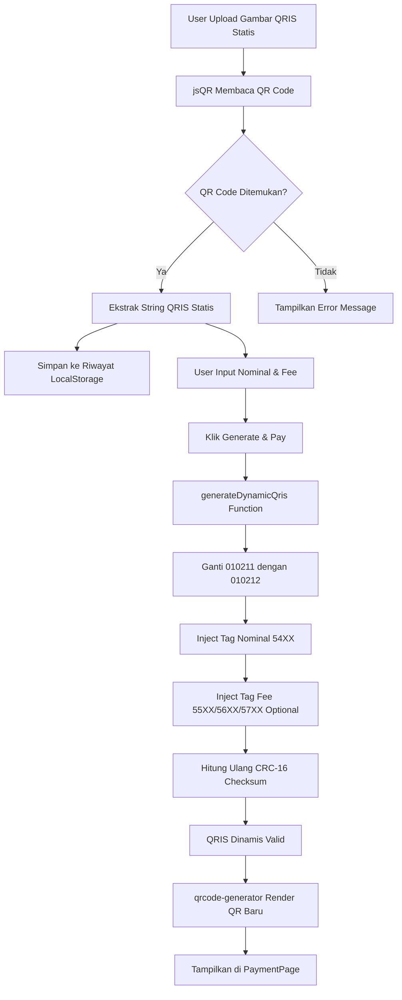
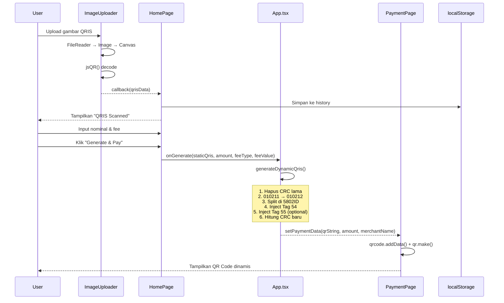

# Dokumentasi Implementasi Fitur QRIS Dinamis

Dokumen ini menjelaskan secara komprehensif bagaimana fitur **upload QRIS statis** diimplementasikan hingga menjadi **QRIS dinamis** yang siap untuk pembayaran.

---

## 📋 Daftar Isi

1. [Gambaran Umum](#gambaran-umum)
2. [Arsitektur Aplikasi](#arsitektur-aplikasi)
3. [Teknologi yang Digunakan](#teknologi-yang-digunakan)
4. [Alur Kerja (Workflow)](#alur-kerja-workflow)
5. [Penjelasan Detail Tiap Komponen](#penjelasan-detail-tiap-komponen)
   - [Upload dan Scanning QRIS](#1-upload-dan-scanning-qris)
   - [Konversi Statis ke Dinamis](#2-konversi-statis-ke-dinamis)
   - [Penghitungan CRC-16 Checksum](#3-penghitungan-crc-16-checksum)
   - [Rendering QR Code Hasil](#4-rendering-qr-code-hasil)
   - [Manajemen Riwayat QRIS](#5-manajemen-riwayat-qris)
6. [Struktur Data QRIS](#struktur-data-qris)
7. [Struktur File Proyek](#struktur-file-proyek)
8. [Diagram Alur Proses](#diagram-alur-proses)

---

## Gambaran Umum

Aplikasi **QRIS Dynamic Generator** adalah tools berbasis web yang mengkonversi QRIS statis menjadi QRIS dinamis. Pengguna dapat:

- ✅ Upload gambar QRIS statis (PNG, JPG, GIF)
- ✅ Otomatis scan dan ekstrak data dari QR Code
- ✅ Menentukan nominal pembayaran
- ✅ Menambahkan biaya transaksi (fee) dalam Rupiah atau Persentase
- ✅ Generate QRIS dinamis baru yang valid untuk pembayaran
- ✅ Menyimpan riwayat QRIS untuk penggunaan kembali

---

## Arsitektur Aplikasi

```
┌──────────────────────────────────────────────────────────────────┐
│                         FRONTEND (React + TypeScript)            │
├──────────────────────────────────────────────────────────────────┤
│                                                                  │
│  ┌─────────────┐    ┌─────────────┐    ┌─────────────────────┐  │
│  │  HomePage   │───▶│   App.tsx   │───▶│    PaymentPage      │  │
│  │   (Form)    │    │ (Core Logic)│    │ (Display QRIS Baru) │  │
│  └─────────────┘    └─────────────┘    └─────────────────────┘  │
│         │                  │                      │              │
│         ▼                  ▼                      ▼              │
│  ┌─────────────┐    ┌─────────────┐    ┌─────────────────────┐  │
│  │ImageUploader│    │generateDyna │    │   qrcode-generator  │  │
│  │   + jsQR    │    │   micQris() │    │   (Render QR)       │  │
│  └─────────────┘    └─────────────┘    └─────────────────────┘  │
│                                                                  │
└──────────────────────────────────────────────────────────────────┘
                              │
                              ▼
                    ┌──────────────────┐
                    │   localStorage   │
                    │ (Riwayat QRIS)   │
                    └──────────────────┘
```

---

## Teknologi yang Digunakan

| Teknologi | Fungsi |
|-----------|--------|
| **React 19** | Framework UI untuk membangun antarmuka pengguna |
| **TypeScript** | Type-safe JavaScript untuk mencegah error |
| **Vite** | Build tool untuk development dan produksi |
| **Tailwind CSS** | Utility-first CSS framework untuk styling |
| **jsQR** | Library untuk membaca/scanning QR code dari gambar |
| **qrcode-generator** | Library untuk membuat/generate QR code baru |
| **Font Awesome** | Icon set untuk UI |

---

## Alur Kerja (Workflow)



---

## Penjelasan Detail Tiap Komponen

### 1. Upload dan Scanning QRIS

**File:** [ImageUploader.tsx](file:///d:/CODING/qris-dinamis/qris-dinamis-generator/components/ImageUploader.tsx)

Komponen ini bertanggung jawab untuk:
- Menerima file gambar dari user (PNG, JPG, GIF)
- Menggunakan Canvas API untuk membaca pixel data dari gambar
- Memanggil library `jsQR` untuk decode QR code

**Kode Kunci:**

```typescript
// 1. User memilih file gambar
const handleFileChange = (event: React.ChangeEvent<HTMLInputElement>) => {
    const file = event.target.files?.[0];
    
    // 2. Baca file sebagai DataURL menggunakan FileReader
    const reader = new FileReader();
    reader.onloadend = () => {
        const result = reader.result as string;
        setImagePreview(result);
        
        // 3. Load gambar ke Image object
        const image = new Image();
        image.onload = () => {
            // 4. Gambar ke Canvas untuk mendapatkan pixel data
            const canvas = canvasRef.current;
            const context = canvas.getContext('2d');
            canvas.width = image.width;
            canvas.height = image.height;
            context.drawImage(image, 0, 0, image.width, image.height);
            
            // 5. Ambil ImageData (raw pixel array)
            const imageData = context.getImageData(0, 0, image.width, image.height);
            
            // 6. jsQR membaca QR code dari pixel data
            const code = jsQR(imageData.data, imageData.width, imageData.height);
            
            if (code) {
                // 7. Berhasil! code.data berisi string QRIS
                onQrDecode(code.data);
            } else {
                // Tidak ditemukan QR code
                onQrDecode(null, 'Could not find a QR code in the image.');
            }
        };
        image.src = result;
    };
    reader.readAsDataURL(file);
};
```

**Alur Proses:**

1. User klik area upload dan memilih file gambar
2. `FileReader` membaca file sebagai Base64 DataURL
3. `Image` object digunakan untuk load gambar
4. Gambar digambar ke `<canvas>` tersembunyi
5. `getImageData()` mengambil raw RGBA pixel array
6. `jsQR()` library menganalisis pixel untuk menemukan dan decode QR code
7. Hasil decode (string QRIS) dikirim ke parent component via callback

---

### 2. Konversi Statis ke Dinamis

**File:** [App.tsx](file:///d:/CODING/qris-dinamis/qris-dinamis-generator/App.tsx)

Ini adalah inti dari aplikasi - fungsi `generateDynamicQris()` yang mengkonversi QRIS statis menjadi dinamis.

**Kode Fungsi:**

```typescript
const generateDynamicQris = (
  staticQris: string,    // String QRIS statis dari scanning
  amount: string,        // Nominal pembayaran
  feeType: 'Persentase' | 'Rupiah',  // Tipe fee
  feeValue: string       // Nilai fee
): string => {
    
    // STEP 1: Hapus 4 karakter terakhir (CRC lama)
    const qrisWithoutCrc = staticQris.substring(0, staticQris.length - 4);
    
    // STEP 2: Ganti indikator statis (010211) dengan dinamis (010212)
    const step1 = qrisWithoutCrc.replace("010211", "010212");
    
    // STEP 3: Split berdasarkan "5802ID" (kode negara Indonesia)
    const parts = step1.split("5802ID");
    // parts[0] = bagian sebelum 5802ID
    // parts[1] = bagian setelah 5802ID
    
    // STEP 4: Buat tag nominal (Tag 54)
    // Format: 54 + [2 digit panjang] + [nominal]
    const amountStr = String(parseInt(amount, 10));
    const amountTag = "54" + String(amountStr.length).padStart(2, '0') + amountStr;
    // Contoh: nominal 50000 → "5405" + "50000" = "540550000"
    
    // STEP 5: Buat tag fee (opsional)
    let feeTag = "";
    if (feeValue && parseFloat(feeValue) > 0) {
        if (feeType === 'Rupiah') {
            // Fee fixed: 55020256 + [panjang] + [nilai]
            const feeValueStr = String(parseInt(feeValue, 10));
            feeTag = "55020256" + String(feeValueStr.length).padStart(2, '0') + feeValueStr;
        } else { // Persentase
            // Fee persen: 55020357 + [panjang] + [nilai]
            const feeValueStr = feeValue;
            feeTag = "55020357" + String(feeValueStr.length).padStart(2, '0') + feeValueStr;
        }
    }
    
    // STEP 6: Gabungkan semua bagian
    const payload = [parts[0], amountTag, feeTag, "5802ID", parts[1]].join('');
    
    // STEP 7: Hitung CRC-16 baru dan tambahkan di akhir
    const finalCrc = crc16(payload);
    
    return payload + finalCrc;
};
```

**Penjelasan Step-by-Step:**

| Step | Deskripsi | Contoh |
|------|-----------|--------|
| 1 | Hapus CRC lama (4 karakter terakhir) | `...63047AFA` → `...6304` |
| 2 | Ubah `010211` (statis) → `010212` (dinamis) | Menandakan QRIS sudah ada nominal |
| 3 | Split di `5802ID` untuk menyisipkan nominal | `[bagian1]5802ID[bagian2]` |
| 4 | Buat Tag 54 untuk nominal | Rp50.000 → `540550000` |
| 5 | Buat Tag 55 untuk fee (optional) | Rp1.000 → `550202560410000` |
| 6 | Gabungkan: bagian1 + nominal + fee + 5802ID + bagian2 | String QRIS baru tanpa CRC |
| 7 | Hitung CRC-16 baru | 4 karakter hex uppercase |

---

### 3. Penghitungan CRC-16 Checksum

**File:** [App.tsx](file:///d:/CODING/qris-dinamis/qris-dinamis-generator/App.tsx)

CRC-16 (Cyclic Redundancy Check) adalah checksum yang memvalidasi integritas data QRIS. Setiap karakter berpengaruh terhadap hasil CRC.

```typescript
const crc16 = (str: string): string => {
    let crc = 0xFFFF;  // Initial value
    const strlen = str.length;
    
    for (let c = 0; c < strlen; c++) {
        crc ^= str.charCodeAt(c) << 8;  // XOR dengan karakter
        
        for (let i = 0; i < 8; i++) {
            if (crc & 0x8000) {
                crc = (crc << 1) ^ 0x1021;  // Polynomial: x^16 + x^12 + x^5 + 1
            } else {
                crc = crc << 1;
            }
        }
    }
    
    const hex = (crc & 0xFFFF).toString(16).toUpperCase();
    return hex.padStart(4, '0');  // Selalu 4 digit
};
```

**Algoritma CRC-16 CCITT:**
- Polynomial: `0x1021`
- Initial Value: `0xFFFF`
- Menghasilkan 4 karakter hexadecimal (uppercase)

> [!IMPORTANT]
> CRC harus dihitung ulang setiap kali string QRIS dimodifikasi. CRC yang salah akan menyebabkan QRIS ditolak saat pembayaran.

---

### 4. Rendering QR Code Hasil

**File:** [PaymentPage.tsx](file:///d:/CODING/qris-dinamis/qris-dinamis-generator/pages/PaymentPage.tsx)

Setelah QRIS dinamis dibuat, halaman ini menampilkan QR code yang siap scan.

```typescript
export const PaymentPage: React.FC<PaymentPageProps> = ({ paymentData, onBack }) => {
    const qrCodeRef = useRef<HTMLDivElement>(null);
    
    useEffect(() => {
        if (paymentData.qrString && qrCodeRef.current) {
            qrCodeRef.current.innerHTML = ''; // Clear previous
            
            // Gunakan qrcode-generator library
            const qr = qrcode(0, 'M');  // Type 0 (auto), Error correction 'M' (Medium)
            qr.addData(paymentData.qrString);  // Masukkan string QRIS dinamis
            qr.make();  // Generate matrix
            
            // Render sebagai image tag
            qrCodeRef.current.innerHTML = qr.createImgTag(8, 4); // (cell size, margin)
            
            // Style image agar responsif
            const img = qrCodeRef.current.querySelector('img');
            if (img) {
                img.style.width = '100%';
                img.style.height = 'auto';
                img.style.imageRendering = 'pixelated';  // Keep sharp pixels
            }
        }
    }, [paymentData.qrString]);
    
    return (
        <>
            <Header title="Qris Payment" onBack={onBack} />
            <div className="flex flex-col items-center p-4 text-center">
                <h2>{paymentData.merchantName}</h2>
                <p>Payment of Rp{formatCurrency(paymentData.amount)}</p>
                
                <div ref={qrCodeRef}>
                    {/* QR Code di-inject di sini */}
                </div>
            </div>
        </>
    );
};
```

---

### 5. Manajemen Riwayat QRIS

**File:** [HomePage.tsx](file:///d:/CODING/qris-dinamis/qris-dinamis-generator/pages/HomePage.tsx)

Aplikasi menyimpan hingga 5 QRIS terakhir di `localStorage` untuk kemudahan penggunaan.

```typescript
const MAX_SAVED_QRIS = 5;

// Load dari localStorage saat komponen mount
useEffect(() => {
    const storedQris = localStorage.getItem('qrisHistory');
    if (storedQris) {
        setSavedQris(JSON.parse(storedQris));
    }
}, []);

// Saat QR code berhasil di-decode
const handleQrDecode = (data: string | null) => {
    if (data) {
        // Cek apakah sudah ada di riwayat
        const isDuplicate = savedQris.some(item => item.qrisString === data);
        
        if (!isDuplicate) {
            // Ekstrak nama merchant dari Tag 59
            const merchantName = parseMerchantName(data);
            
            const newItem: SavedQrisItem = { merchantName, qrisString: data };
            
            // Tambah di depan, limit maksimal 5
            let newHistory = [newItem, ...savedQris];
            if (newHistory.length > MAX_SAVED_QRIS) {
                newHistory = newHistory.slice(0, MAX_SAVED_QRIS);
            }
            
            // Update state dan localStorage
            setSavedQris(newHistory);
            localStorage.setItem('qrisHistory', JSON.stringify(newHistory));
        }
    }
};
```

---

## Struktur Data QRIS

QRIS mengikuti format **EMVCo QR Code Specification** dengan struktur TLV (Tag-Length-Value).

### Format Tag

```
[ID][LENGTH][VALUE]
  │     │      │
  │     │      └── Data aktual (panjang sesuai LENGTH)
  │     └── 2 digit: panjang VALUE dalam karakter
  └── 2 digit: identifier tag
```

### Tag-Tag Penting

| Tag | Nama | Deskripsi | Contoh |
|-----|------|-----------|--------|
| `00` | Format Indicator | Versi format | `000201` = versi 01 |
| `01` | Point of Initiation | Static/Dynamic | `010211` (statis), `010212` (dinamis) |
| `26-51` | Merchant Account | Info merchant | Berisi NMID, dll |
| `52` | Merchant Category Code | Kode kategori | `52045812` |
| `53` | Transaction Currency | Mata uang | `5303360` (IDR = 360) |
| **`54`** | **Transaction Amount** | **Nominal** | `540550000` (Rp50.000) |
| **`55`** | **Tip/Convenience Indicator** | **Fee type** | `55020256xx` atau `55020357xx` |
| `58` | Country Code | Kode negara | `5802ID` (Indonesia) |
| `59` | Merchant Name | Nama merchant | `5913WARUNG MAKAN` |
| `60` | Merchant City | Kota merchant | `6007JAKARTA` |
| `63` | CRC | Checksum 4 digit | `63047AFA` |

### Contoh Struktur QRIS

```
00020101021126610014ID.CO.QRIS.WWW011893600500000000010302080002046012520400005303360
│      │      │                                                                    │
│      │      └──────────────── Merchant Account Info ─────────────────────────────┤
│      └── Point of Initiation (statis)                                            │
└── Format Indicator                                                               │
                                                                                   │
5802ID5915TOKO SEJAHTERA6007JAKARTA6304XXXX
│      │                 │          │
│      │                 │          └── CRC Checksum
│      │                 └── Merchant City
│      └── Merchant Name
└── Country Code
```

### Perbedaan QRIS Statis vs Dinamis

| Aspek | Statis (`010211`) | Dinamis (`010212`) |
|-------|-------------------|---------------------|
| Nominal | Tidak ada (Tag 54 kosong) | Ada nominal spesifik |
| Penggunaan | Pelanggan input nominal manual | Nominal sudah fix |
| Keamanan | Bisa terjadi salah input | Tidak bisa salah input |
| Tag 54 | ❌ Tidak ada | ✅ `54XX[nominal]` |

---

## Struktur File Proyek

```
qris-dinamis-generator/
├── index.html              # Entry point HTML dengan CDN libraries
├── index.tsx               # React entry point
├── App.tsx                 # ⭐ Core logic (generateDynamicQris, crc16)
├── types.ts                # TypeScript type definitions
├── package.json            # Dependencies dan scripts
├── vite.config.ts          # Vite configuration
├── tsconfig.json           # TypeScript configuration
│
├── pages/
│   ├── HomePage.tsx        # ⭐ Form input, upload, history
│   └── PaymentPage.tsx     # ⭐ Display QR code hasil
│
└── components/
    ├── ImageUploader.tsx   # ⭐ Upload file dan scan QR
    ├── Header.tsx          # Header dengan judul dan navigasi
    ├── FormField.tsx       # Wrapper untuk form field
    └── icons.tsx           # SVG icon components
```

**File Kunci:**

| File | Fungsi Utama |
|------|--------------|
| [App.tsx](file:///d:/CODING/qris-dinamis/qris-dinamis-generator/App.tsx) | `generateDynamicQris()`, `crc16()`, `parseMerchantName()` |
| [ImageUploader.tsx](file:///d:/CODING/qris-dinamis/qris-dinamis-generator/components/ImageUploader.tsx) | Upload gambar, Canvas API, `jsQR()` scanning |
| [HomePage.tsx](file:///d:/CODING/qris-dinamis/qris-dinamis-generator/pages/HomePage.tsx) | Form input, localStorage history |
| [PaymentPage.tsx](file:///d:/CODING/qris-dinamis/qris-dinamis-generator/pages/PaymentPage.tsx) | Render QR dengan `qrcode-generator` |

---

## Diagram Alur Proses



---

## Kesimpulan

Implementasi QRIS Dynamic Generator ini mengikuti standar **EMVCo QR Code** yang digunakan di Indonesia. Proses konversi dari QRIS statis ke dinamis melibatkan:

1. **Scanning** - Membaca QR code dari gambar menggunakan `jsQR`
2. **Parsing** - Memahami struktur TLV dari string QRIS
3. **Modification** - Mengubah indikator dan menyisipkan nominal/fee
4. **Validation** - Menghitung ulang CRC-16 checksum
5. **Rendering** - Membuat QR code baru yang valid

> [!TIP]
> Untuk pengembangan lebih lanjut, pertimbangkan untuk menambahkan validasi format QRIS yang lebih ketat dan dukungan untuk berbagai jenis merchant account.
