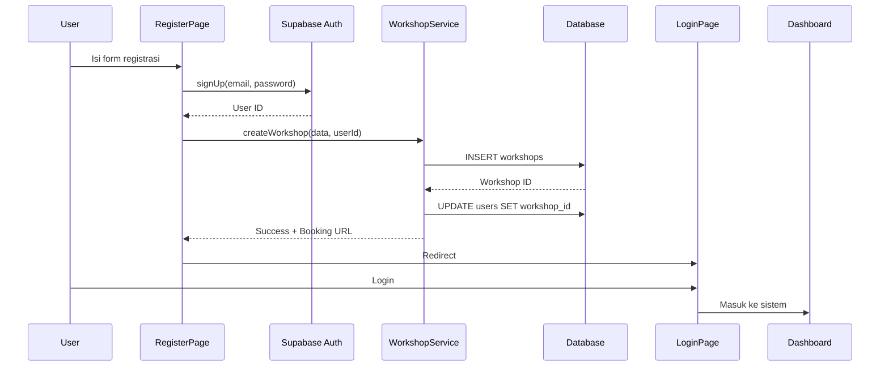

# 📝 Panduan Registrasi & Multi-Tenant System

## 🎯 Overview

Sistem ABE.AUTO sekarang mendukung multi-tenant, dimana setiap workshop memiliki:

- **Database terpisah** (data terisolasi)
- **URL booking unik** per workshop
- **Staff management** terpisah per workshop
- **Settings independen** (QRIS, time slots, dll)

---

## 🚀 Fitur Registrasi Workshop Baru

### 1. Halaman Register (`/register`)

**Akses:** Klik "Daftar Sekarang" di halaman Login

**Form Registration:**

- **Informasi Pemilik:**
  - Nama Lengkap
  - Email (untuk login)
  - Password (min 6 karakter)
  - Konfirmasi Password

- **Informasi Workshop:**
  - Nama Workshop (required)
  - No. Telepon
  - Alamat
  - Deskripsi (opsional)

**Proses Registration:**

1. User mengisi form
2. System membuat:
   - Akun Supabase Auth
   - Workshop baru dengan slug unik
   - User record sebagai OWNER
3. Redirect ke halaman Login
4. User login dengan email & password

---

## 🔗 URL Booking Per Workshop

### Cara Mendapatkan Booking URL

**Di Sidebar (setelah login):**

```
┌─────────────────────────────┐
│  📎 Booking URL             │
│  ┌─────────────────────┐   │
│  │ yourdomain.com/     │   │
│  │ booking/workshop-slug│   │
│  └─────────────────────┘   │
│  [Copy Link] Button         │
└─────────────────────────────┘
```

### Fitur:

- ✅ **Auto-generate** dari workshop name
- ✅ **Tampil di sidebar** untuk semua staff
- ✅ **Copy to clipboard** dengan 1 klik
- ✅ **Unique per workshop** (dijamin tidak duplikat)

### Contoh URL:

```
https://your-app.com/booking/abe-auto-jakarta
https://your-app.com/booking/bengkel-jaya-surabaya
https://your-app.com/booking/servis-mobil-bandung
```

---

## 🏗️ Arsitektur Multi-Tenant

### 1. Database Structure

```sql
workshops (tenant master)
├── id (UUID)
├── name
├── slug (URL identifier)
├── address, phone, email
└── settings (JSONB)

users
├── id
├── workshop_id (FK → workshops)
├── is_owner (boolean)
└── ... (other fields)

bookings, service_records, inventory, etc.
└── workshop_id (FK → workshops)
```

### 2. Row Level Security (RLS)

**Prinsip:**

- Setiap tabel punya `workshop_id`
- RLS memastikan user hanya akses data workshop mereka
- Public dapat akses untuk guest booking

**Contoh Policy:**

```sql
CREATE POLICY "Workshop staff can view bookings"
ON bookings FOR SELECT
USING (
  workshop_id IN (
    SELECT workshop_id FROM users WHERE id = auth.uid()
  )
);
```

---

## 📋 Flow Registrasi Workshop

### Step-by-Step



### Code Implementation

**RegisterPage.tsx:**

```typescript
// 1. Create Auth User
const { data: authData } = await supabase.auth.signUp({
  email: formData.email,
  password: formData.password,
});

// 2. Create Workshop
const { workshop } = await createWorkshop(
  {
    name: formData.workshopName,
    phone: formData.phone,
    address: formData.address,
    description: formData.description,
    email: formData.email,
  },
  authData.user.id,
);

// 3. Create User Record
await supabase.from("users").insert({
  id: authData.user.id,
  name: formData.ownerName,
  email: formData.email,
  role: Role.OWNER,
  workshop_id: workshop.id,
  is_owner: true,
});
```

---

## 🎨 Sidebar Booking URL

### Implementasi

**NewSidebar.tsx:**

```typescript
const [workshop, setWorkshop] = useState<Workshop | null>(null);
const [bookingUrl, setBookingUrl] = useState("");

useEffect(() => {
  const loadWorkshop = async () => {
    const workshopData = await getCurrentWorkshop();
    if (workshopData) {
      setWorkshop(workshopData);
      setBookingUrl(`${window.location.origin}/booking/${workshopData.slug}`);
    }
  };

  if (currentUser) {
    loadWorkshop();
  }
}, [currentUser]);
```

**workshopService.ts:**

```typescript
export async function getCurrentWorkshop(): Promise<Workshop | null> {
  // Get from authenticated user
  const {
    data: { user },
  } = await supabase.auth.getUser();
  if (!user) return null;

  // Get user's workshop_id
  const { data: userData } = await supabase
    .from("users")
    .select("workshop_id")
    .eq("id", user.id)
    .single();

  if (!userData?.workshop_id) return null;

  // Get workshop details
  return getWorkshopById(userData.workshop_id);
}
```

---

## 🔐 Security & Permissions

### 1. RLS Policies

**Public Access (for guest booking):**

```sql
-- View workshops
CREATE POLICY "Public can view active workshops"
ON workshops FOR SELECT
USING (is_active = true);

-- Create bookings
CREATE POLICY "Public can create bookings"
ON bookings FOR INSERT TO anon
WITH CHECK (true);
```

**Authenticated Access:**

```sql
-- View own workshop data
CREATE POLICY "Workshop staff can view bookings"
ON bookings FOR SELECT TO authenticated
USING (
  workshop_id IN (
    SELECT workshop_id FROM users WHERE id = auth.uid()
  )
);

-- Owners can manage settings
CREATE POLICY "Owners can manage workshop"
ON workshops FOR ALL TO authenticated
USING (
  id IN (
    SELECT workshop_id FROM users
    WHERE id = auth.uid() AND is_owner = true
  )
);
```

### 2. Role-Based Access

**Hierarchy:**

- **OWNER**: Full access, can manage workshop settings
- **ADMIN**: Can manage staff, bookings, settings
- **KASIR**: Front office, bookings, payments
- **MEKANIK**: Service queue, workbench

**Implementation:**

```typescript
<ProtectedRoute
  currentUser={currentUser}
  allowedRoles={[Role.OWNER]}
>
  <WorkshopSettings />
</ProtectedRoute>
```

---

## 🛠️ Helper Functions

### workshopService.ts

```typescript
// Get workshop by slug (for guest booking)
getWorkshopBySlug(slug: string): Promise<Workshop | null>

// Get current user's workshop
getCurrentWorkshop(): Promise<Workshop | null>

// Create new workshop
createWorkshop(data, ownerId): Promise<Workshop>

// Update workshop
updateWorkshop(id, updates): Promise<boolean>

// Generate unique slug
generateSlug(name: string): string

// Staff invitations
createStaffInvitation(workshopId, email, role)
acceptInvitation(inviteCode, userId)
```

---

## 📊 Data Flow

### Guest Booking

```
Guest → /booking/:slug
   ↓
Get workshop by slug
   ↓
Show booking form with workshop info
   ↓
Submit booking with workshop_id
   ↓
Save to bookings table
   ↓
Generate tracking code
```

### Staff Login

```
Staff → /login
   ↓
Auth with Supabase
   ↓
Get user's workshop_id
   ↓
Load workshop data
   ↓
Show sidebar with booking URL
   ↓
Access only own workshop data (RLS)
```

---

## 🎯 Testing Checklist

### Registration Flow

- [ ] Buka `/register`
- [ ] Isi form dengan data lengkap
- [ ] Submit dan dapat konfirmasi sukses
- [ ] Redirect ke `/login`
- [ ] Login dengan email & password baru
- [ ] Masuk ke dashboard
- [ ] Cek sidebar ada Booking URL
- [ ] Copy booking URL dan buka di tab baru
- [ ] Guest booking form muncul dengan info workshop

### Multi-Tenant Isolation

- [ ] Register workshop kedua dengan email berbeda
- [ ] Login ke workshop 1, cek data
- [ ] Login ke workshop 2, cek data berbeda
- [ ] Pastikan data tidak tercampur

### Booking URL

- [ ] URL unik per workshop
- [ ] Slug auto-generate dari nama
- [ ] Copy button berfungsi
- [ ] Guest dapat akses booking form
- [ ] Booking masuk ke workshop yang benar

---

## 🚨 Troubleshooting

### Problem: Booking URL tidak muncul

**Solution:**

1. Pastikan user sudah login
2. Cek `workshop_id` di users table
3. Cek workshop exists di workshops table
4. Reload page atau re-login

### Problem: Guest booking gagal

**Solution:**

1. Cek slug valid di URL
2. Cek workshop `is_active = true`
3. Cek RLS policy untuk public access
4. Lihat browser console untuk error

### Problem: Data workshop lain terlihat

**Solution:**

1. RLS policies belum dijalankan
2. Jalankan migration script lagi
3. Cek `workshop_id` di semua records
4. Logout dan login ulang

---

## 📚 File References

### Frontend

- `/src/pages/RegisterPage.tsx` - Registration form
- `/src/pages/LoginPage.tsx` - Login with register link
- `/src/components/NewSidebar.tsx` - Sidebar with booking URL
- `/src/pages/GuestBooking.tsx` - Guest booking per workshop
- `/src/pages/WorkshopSettings.tsx` - Workshop settings
- `/App.tsx` - Routes including `/register`

### Backend

- `/services/workshopService.ts` - Workshop operations
- `/services/multi_tenant_migration.sql` - Database migration

### Types

- `/types.ts` - Workshop, User, and related interfaces

---

## 🎉 Summary

✅ **Registration:** User dapat daftar workshop baru via `/register`

✅ **Booking URL:** Setiap workshop punya URL unik `/booking/:slug`

✅ **Sidebar Display:** URL booking tampil di sidebar, bisa di-copy

✅ **Auto-Detection:** System otomatis tahu workshop dari user yang login

✅ **Data Isolation:** RLS pastikan data terpisah per workshop

✅ **Guest Booking:** Public bisa booking tanpa login via workshop URL

---

**Next Steps:**

1. Run migration: `multi_tenant_migration.sql`
2. Test registration flow
3. Share booking URLs with customers
4. Manage staff per workshop
5. Configure settings independently
